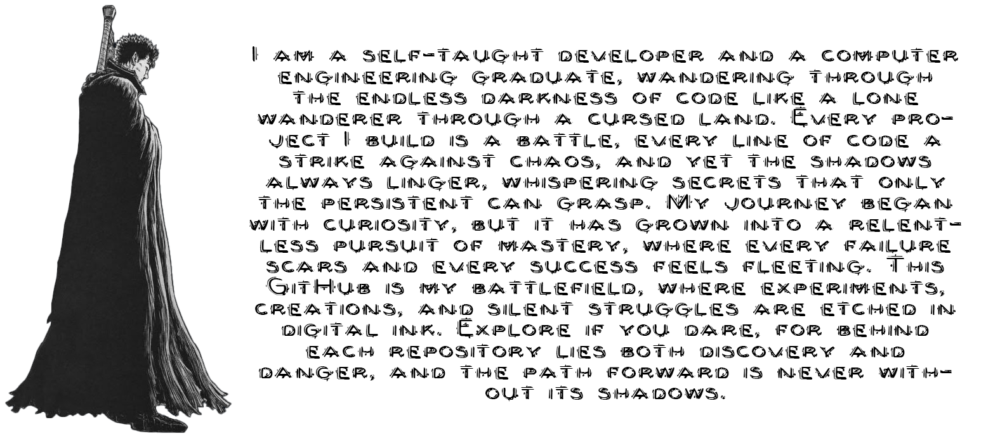
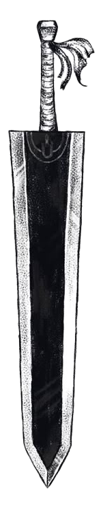

    <picture>
        <source media="(prefers-color-scheme: dark)" srcset="Media/Text_Light.png" alt="Text"/>
        
    </picture>
    

# 

    <picture>
        <source media="(prefers-color-scheme: dark)" srcset="Media/AboutMe_Light.png" alt="GutsText"/>
        
    </picture>
    <picture>
        <source media="(prefers-color-scheme: dark)" srcset="Media/GutsText_Dark.png" alt="GutsText"/>
        
    </picture>

#

    <picture>
        <source media="(prefers-color-scheme: dark)" srcset="Media/SocialMedia_Light.png" alt="SocialMedia"/>
        
    </picture>

    <picture>
        <source media="(prefers-color-scheme: dark)" srcset="Media/Casca.png" alt="Casca" height="329px" align="right"/>
        
    </picture>
      
    <a href="https://t.me/mammaddrik">
        <picture>
            <source media="(prefers-color-scheme: dark)" srcset="Media/Telegram_Light.png" alt="Telegram"/>
            
        </picture>
    </a>
    <a href="http://www.instagram.com/mammad.drik">
        <picture>
            <source media="(prefers-color-scheme: dark)" srcset="Media/Instagram_Light.png" alt="Instagram"/>
            
        </picture>
    </a>
    <a href="https://www.linkedin.com/in/mammaddrik/">
        <picture>
            <source media="(prefers-color-scheme: dark)" srcset="Media/LinkedIn_Light.png" alt="LinkedIn"/>
            
        </picture>
    </a>
    <a href="https://steamcommunity.com/id/Buddy_Bee/">
        <picture>
            <source media="(prefers-color-scheme: dark)" srcset="Media/Steam_Light.png" alt="Steam"/>
            
        </picture>
    </a>
    <a href="https://www.youtube.com/@quipu-code">
        <picture>
            <source media="(prefers-color-scheme: dark)" srcset="Media/YouTube_Light.png" alt="YouTube"/>
            
        </picture>
    </a>
    <!-- <a href="https://www.youtube.com/@quipu-code">
        <picture>
            <source media="(prefers-color-scheme: dark)" srcset="Media/YouTube_Light.png" alt="YouTube"/>
            
        </picture>
    </a> -->
       

#

    <picture>
        <source media="(prefers-color-scheme: dark)" srcset="Media/SkillsTools_Light.png" alt="Skill&Tools"/>
        
    </picture>

    <picture>
        <source media="(prefers-color-scheme: dark)" srcset="Media/Sword_Dark.png" alt="Sword" height="600px" align="left"/>
        
    </picture>

     
    <picture>
        <source media="(prefers-color-scheme: dark)" srcset="Media/Python_Light.png" alt="Python" align="Left"/>
        
    </picture>
    <picture>
        <source media="(prefers-color-scheme: dark)" srcset="Media/Git_Light.png" alt="Git" align="Left"/>
        
    </picture>
     
    <picture>
        <source media="(prefers-color-scheme: dark)" srcset="Media/Django_Light.png" alt="Django" align="Left"/>
        
    </picture>
    <picture>
        <source media="(prefers-color-scheme: dark)" srcset="Media/MySQL_Light.png" alt="MySQL" align="Left"/>
        
    </picture>
    <picture>
        <source media="(prefers-color-scheme: dark)" srcset="Media/Bash_Light.png" alt="Bash" align="Left"/>
        
    </picture>
    <picture>
        <source media="(prefers-color-scheme: dark)" srcset="Media/Linux_Light.png" alt="Linux" align="Left"/>
        
    </picture>
    <picture>
        <source media="(prefers-color-scheme: dark)" srcset="Media/Ruby_Light.png" alt="Ruby" align="Left"/>
        
    </picture>
    <picture>
        <source media="(prefers-color-scheme: dark)" srcset="Media/Photoshop_Light.png" alt="Photoshop" align="Left"/>
        
    </picture>
    <picture>
        <source media="(prefers-color-scheme: dark)" srcset="Media/JavaScript_Light.png" alt="JavaScript" align="Left"/>
        
    </picture>
    <picture>
        <source media="(prefers-color-scheme: dark)" srcset="Media/XD_Light.png" alt="XD" align="Left"/>
        
    </picture>
    <picture>
        <source media="(prefers-color-scheme: dark)" srcset="Media/Html_Light.png" alt="Html" align="Left"/>
        
    </picture>
    <picture>
        <source media="(prefers-color-scheme: dark)" srcset="Media/Docker_Light.png" alt="Docker" align="Left"/>
        
    </picture>
    <picture>
        <source media="(prefers-color-scheme: dark)" srcset="Media/Css_Light.png" alt="Css" align="Left"/>
        
    </picture>
    <picture>
        <source media="(prefers-color-scheme: dark)" srcset="Media/WordPress_Light.png" alt="WordPress" align="Left"/>
        
    </picture>

    <picture>
        <source media="(prefers-color-scheme: dark)" srcset="Media/MyProjects_Light.png" alt="Skill&Tools"/>
        
    </picture>

#

    <picture>
        <source media="(prefers-color-scheme: dark)" srcset="Media/Stats_Light.png" alt="Skill&Tools"/>
        
    </picture>

    <picture>
        <source media="(prefers-color-scheme: dark)" srcset="https://github-readme-stats.vercel.app/api?username=mammaddrik&show_icons=true&bg_color=0D1117&title_color=fff&icon_color=881F1F&text_color=fff&hide_border=true&rank_icon=github&hide_title=true" alt="Skill&Tools" height='151px'/>
        
    </picture>
    <picture>
        <source media="(prefers-color-scheme: dark)" srcset="https://streak-stats.demolab.com?user=mammaddrik&background=0D1117&ring=fff&fire=881F1F&currStreakNum=fff&currStreakLabel=881F1F&sideNums=fff&sideLabels=fff&dates=fff&hide_border=true&date_format=%5BY.%5Dn.j" alt="Skill&Tools" height='151px' align="right"/>
        
    </picture>
    <picture>
        <source media="(prefers-color-scheme: dark)" srcset="https://github-readme-activity-graph.vercel.app/graph?username=mammaddrik&show_icons=true&bg_color=0D1117&color=fff&line=881F1F&point=fff&hide_title=true&hide_border=true" alt="Skill&Tools"/>
        
    </picture>

<!--  -->

<!--   -->

<!--  -->

<!-- <picture>
        <source media="(prefers-color-scheme: dark)" srcset="https://github-readme-stats.vercel.app/api/top-langs/?username=mammaddrik&langs_count=10&title_color=881F1F&text_color=fff&bg_color=0D1117&locale=en&hide_border=true&custom_title=Top%20%Languages&hide_progress=true" alt="Top Languages"/>
        
</picture> -->

<!-- 

</a>

  
  
  
  
<h1 align="center">Socials</h1>

<a href="https://www.x.com/mammaddrik" target="_blank" rel="noreferrer"> <picture> <source media="(prefers-color-scheme: dark)" srcset="https://raw.githubusercontent.com/danielcranney/readme-generator/main/public/icons/socials/twitter-dark.svg" /> <source media="(prefers-color-scheme: light)" srcset="https://raw.githubusercontent.com/danielcranney/readme-generator/main/public/icons/socials/twitter.svg" />  </picture> </a>

<h1 align="center">Stats</h1>

 </h1>

  
 -->
<!-- Feel free to add me if you need any help -->
