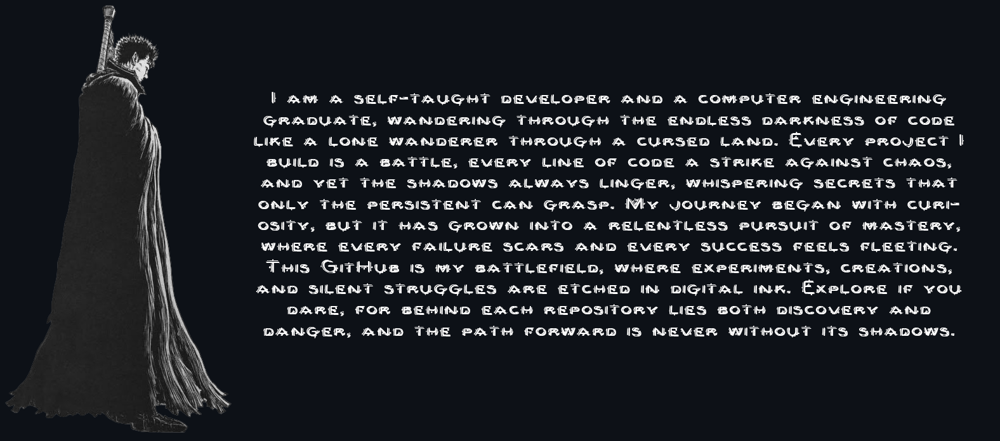
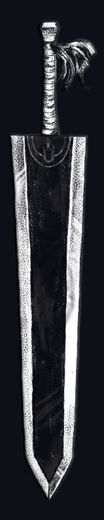

    

        
    

    <h1></h1>
    <picture>
        <source media="(prefers-color-scheme: dark)" srcset="Media/Text/10.png" alt="Skill"/>
        
    </picture>
     
    <a href="#">
        
        <h1></h1><h1></h1><h1></h1><h1></h1><h1></h1><h1></h1><h1></h1><h1></h1><h1></h1><h1></h1><h1></h1><h1></h1><h1></h1><h1></h1> <h1></h1>
    </a>
    <picture>
        <source media="(prefers-color-scheme: dark)" srcset="Media/Text/4.png" alt="Skill"/>
        
    </picture>
    

   

| First Header  | Second Header |
| ------------- | ------------- |
| Content Cell  | Content Cell  |
| Content Cell  | Content Cell  |

<!--  -->

<!-- <picture>
        <source media="(prefers-color-scheme: dark)" srcset="https://github-readme-stats.vercel.app/api/top-langs/?username=mammaddrik&langs_count=10&title_color=881F1F&text_color=fff&bg_color=0D1117&locale=en&hide_border=true&custom_title=Top%20%Languages&hide_progress=true" alt="Top Languages"/>
        
</picture> -->

<!-- 

</a>

  
  
  
  
<h1 align="center">Socials</h1>

<a href="https://www.x.com/mammaddrik" target="_blank" rel="noreferrer"> <picture> <source media="(prefers-color-scheme: dark)" srcset="https://raw.githubusercontent.com/danielcranney/readme-generator/main/public/icons/socials/twitter-dark.svg" /> <source media="(prefers-color-scheme: light)" srcset="https://raw.githubusercontent.com/danielcranney/readme-generator/main/public/icons/socials/twitter.svg" />  </picture> </a>

<h1 align="center">Stats</h1>

 </h1>

  
 -->
